# Kronos Architecture

Kronos is a zero-dependency Go backup platform for scheduled, encrypted, verified database backups. The repository is currently beyond a skeleton: it contains the core CLI, a control-plane HTTP server, embedded state storage, scheduler orchestration, agent workers, backup and restore pipelines, manifest verification, retention planning, audit logging, webhook notifications, local and S3-compatible storage backends, Redis driver support, a PostgreSQL logical driver MVP, OpenAPI coverage, an operations overview API, and an embedded React/Tailwind WebUI shell.

The project is still in active implementation. The architectural foundation is in place and heavily tested, while broader database driver coverage and some product surfaces described in `.project/IMPLEMENTATION.md` remain roadmap work.

## Quick Navigation

- [Current State](#current-state)
- [High-Level System](#high-level-system)
- [Repository Layout](#repository-layout)
- [Core Package Responsibilities](#core-package-responsibilities)
- [Control-Plane Request Path](#control-plane-request-path)
- [Job Lifecycle](#job-lifecycle)
- [Scheduler And Dispatch](#scheduler-and-dispatch)
- [Backup Data Path](#backup-data-path)
- [Restore Data Path](#restore-data-path)
- [Metadata Model](#metadata-model)
- [Storage Layout](#storage-layout)
- [Security And Integrity](#security-and-integrity)
- [Implementation Status By Area](#implementation-status-by-area)
- [Source Map](#source-map)
- [Roadmap Gaps](#roadmap-gaps)

## Current State

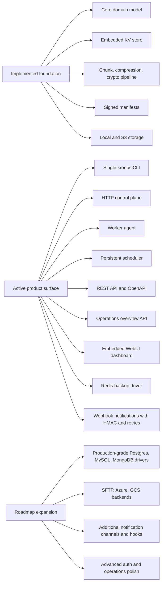

## High-Level System

Kronos is organized as one static Go binary with multiple operating modes:

- `kronos server` runs the control plane.
- `kronos agent --work` runs a worker that claims and executes jobs.
- `kronos local --work` can run a local embedded control plane and worker.
- Administrative commands use the same binary and can operate locally or against the server API.

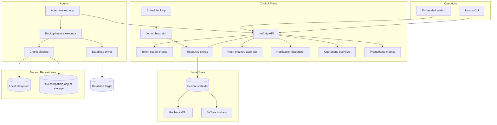

## Repository Layout

```mermaid
flowchart TD
    root[Repository root]
    root --> cmd[cmd/kronos]
    root --> internal[internal]
    root --> api[api/openapi]
    root --> docs[docs]
    root --> project[.project]

    cmd --> cli[CLI command dispatcher and commands]
    cmd --> serverCmd[server, local, agent entrypoints]

    internal --> core[core domain types]
    internal --> config[config and secret expansion]
    internal --> server[control-plane stores and orchestration]
    internal --> agent[agent client and worker loop]
    internal --> drivers[database drivers]
    internal --> engine[driver to pipeline bridge]
    internal --> chunk[chunking, hashing, dedup pipeline]
    internal --> compress[compression adapters]
    internal --> crypto[AEAD, KDF, key slots]
    internal --> repository[manifest commit and load]
    internal --> manifest[signed manifest format]
    internal --> storage[storage backend contract]
    internal --> kvstore[embedded page store]
    internal --> audit[audit chain]
    internal --> retention[retention resolver]
    internal --> schedule[cron and queue logic]
    internal --> restore[restore planning]
    internal --> verify[verification routines]
    internal --> webui[embedded static handler and built assets]

    api --> openapi[Checked OpenAPI spec]
```

## Core Package Responsibilities

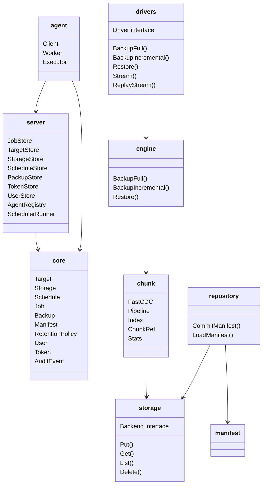

## Control-Plane Request Path

The control plane is built directly on `net/http`. Persistent mode opens `state.db`, creates typed stores, seeds resources from config, starts the scheduler loop, and serves `/healthz`, `/readyz`, `/metrics`, `/api/v1/*`, `/api/v1/overview`, and the embedded WebUI. Health, readiness, metrics, and overview endpoints accept both `GET` and `HEAD` so probes can verify availability without transferring response bodies.

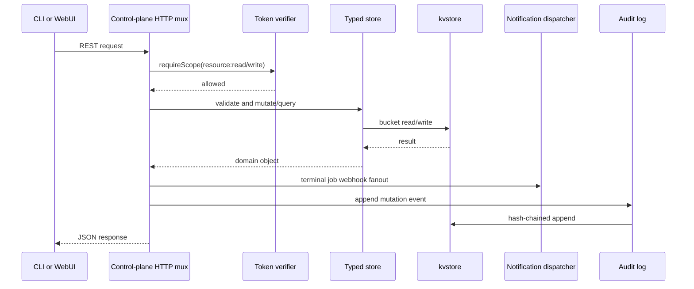

```mermaid
flowchart LR
    UI[WebUI or CLI] --> Overview[/api/v1/overview]
    Overview --> Agents[Agent registry]
    Overview --> Jobs[Job store]
    Overview --> Backups[Backup store]
    Overview --> Inventory[Targets, storage, schedules, policies, notifications, users]
    Overview --> Summary[Compact JSON dashboard summary]
```

## Job Lifecycle

Jobs are persisted in the embedded store so scheduled and manual work survives restarts. On startup, active jobs are failed as `server_lost`; during scheduler ticks, jobs assigned to stale agents can be failed as `agent_lost`.

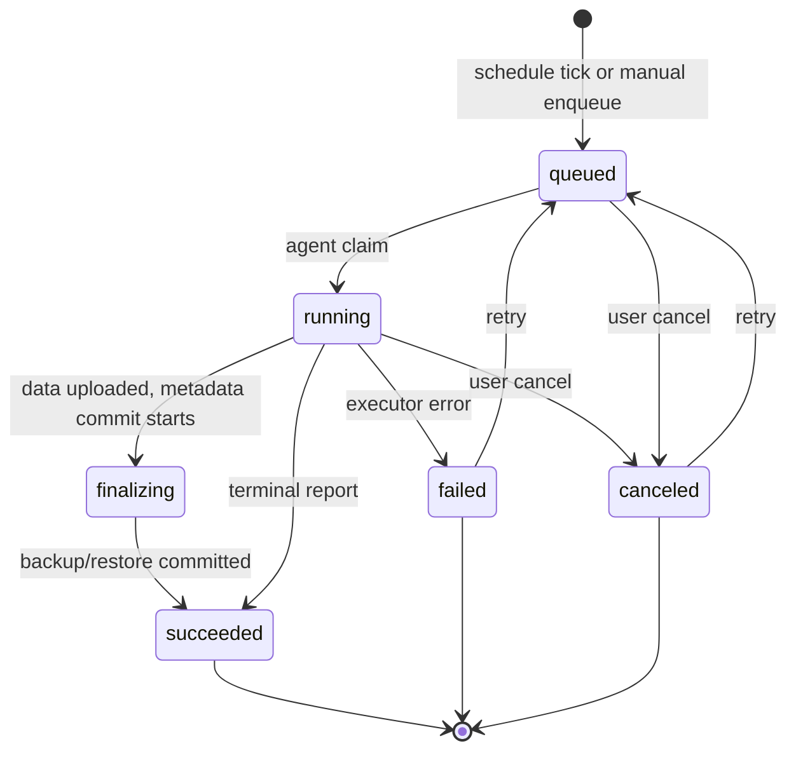

## Scheduler And Dispatch

Schedules use cron expressions, `@between` windows, stable jitter, catch-up policies, and per-target queueing. The server-side scheduler loop turns due schedules into durable queued jobs, and workers claim jobs through the control-plane API.

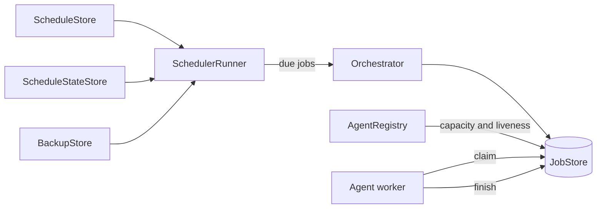

## Backup Data Path

The backup path is streaming-first. A driver emits logical records, the engine serializes them as JSON lines, and the chunk pipeline performs content-defined chunking, BLAKE3 hashing, deduplication, compression, encryption, upload, and manifest reference generation.

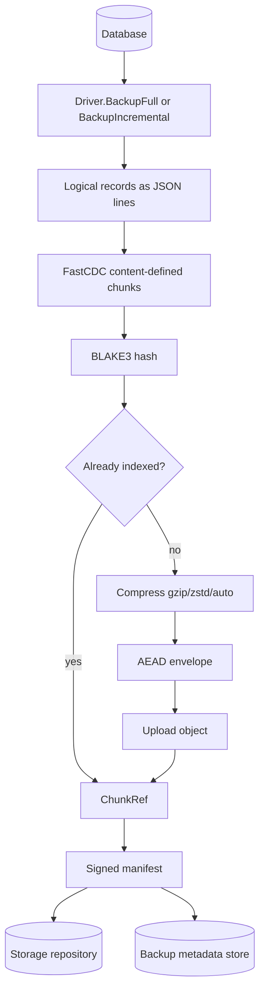

## Chunk Pipeline Worker Graph

The pipeline uses bounded channels and worker groups. References are sorted by sequence before the final manifest is committed, preserving the original stream order even when hash, encode, and upload work happens concurrently.

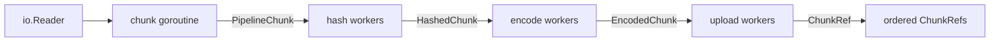

## Restore Data Path

Restore planning validates the backup parent chain before work is enqueued. The agent reconstructs chunk references from storage, decrypts and decompresses payloads, verifies content hashes, and streams records back into the target driver.

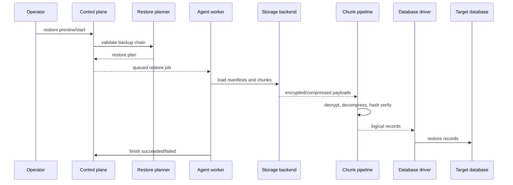

## Metadata Model

The persisted control-plane model is intentionally small and operational. Immutable backup payloads live in object storage, while mutable operational metadata lives in `state.db`.

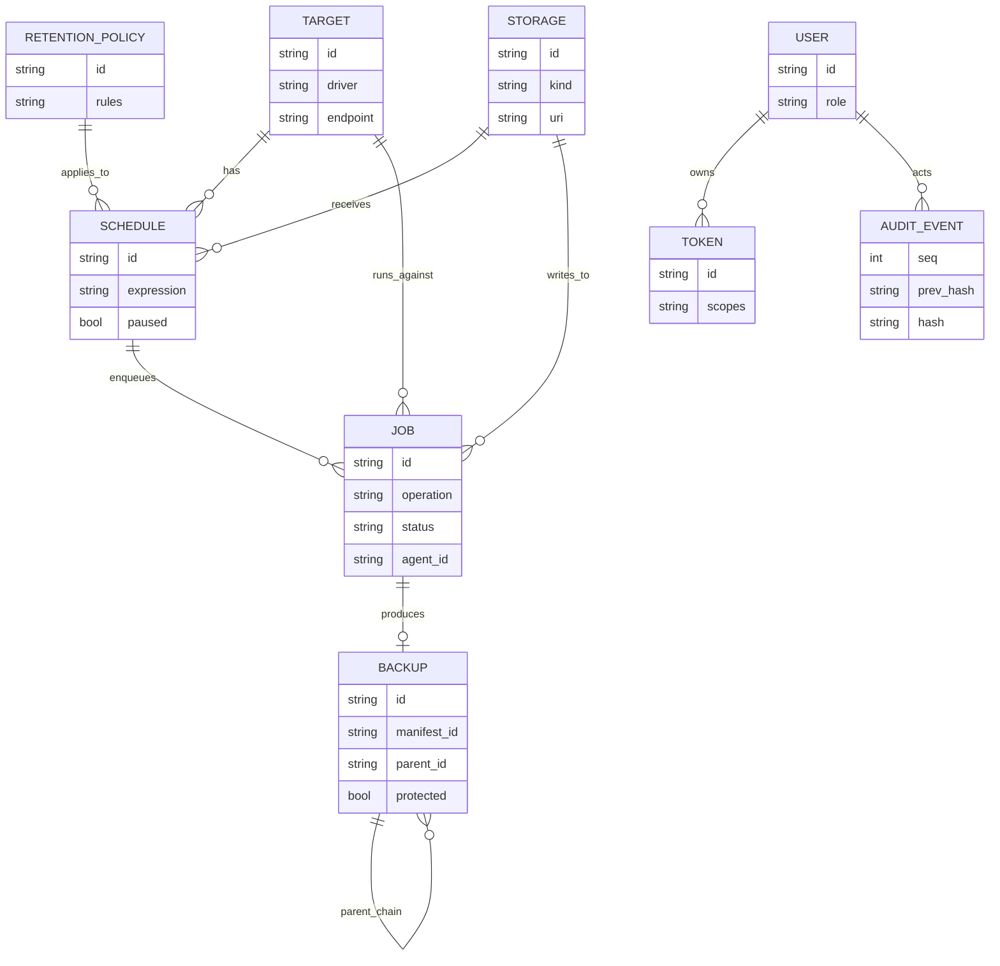

## Storage Layout

Kronos separates operational state from repository objects:

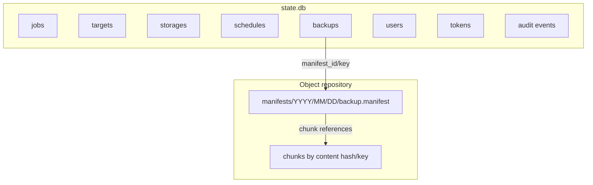

## Security And Integrity

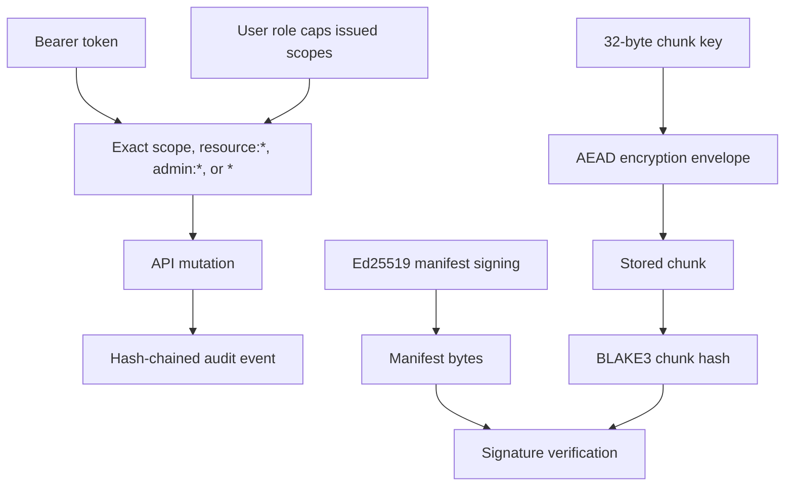

Key points:

- API tokens are stored as hashed verifiers; bearer secrets are shown once.
- Token scopes are checked on protected endpoints.
- API, health, readiness, and metrics responses are marked `Cache-Control:
  no-store`; WebUI HTML revalidates while fingerprinted assets are immutable;
  API and WebUI responses carry baseline browser security headers.
- Manifest signing keys and chunk encryption keys are separate.
- Chunk-level verification decrypts, decompresses, and hashes payloads.
- Administrative mutations can be recorded in a hash-chained audit log.

## Embedded KV Store

The control plane uses a pure-Go embedded key-value store rather than an external database. It is page-based, bucketed, protected by rollback WAL, and has repair coverage.

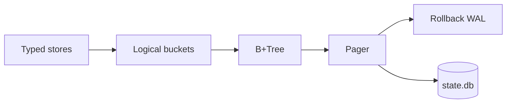

## Build And Verification Pipeline

The repository is Go-first, with the WebUI built separately and embedded into the Go binary.

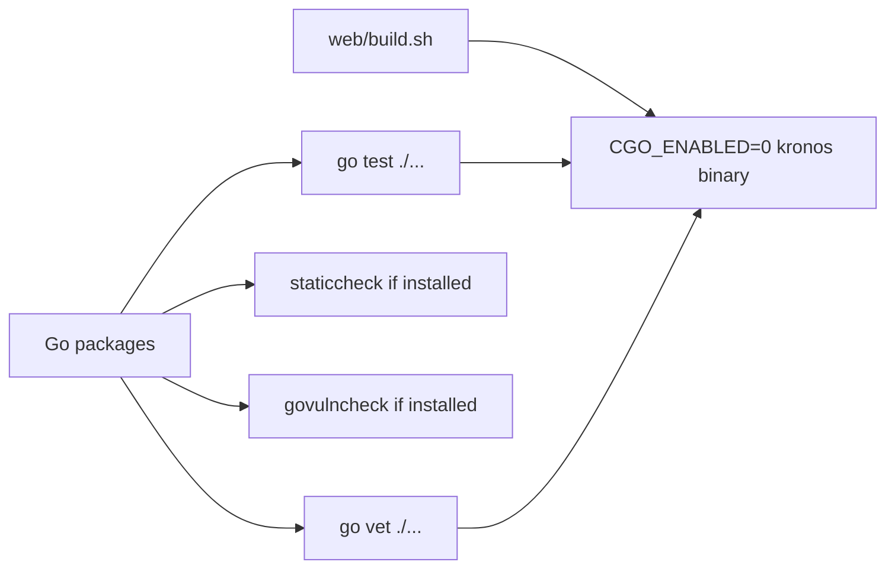

Common commands:

```bash
make build
make test
make check
make ui
```

## Implementation Status By Area

| Area | Status | Notes |
| --- | --- | --- |
| CLI | Implemented and broad | Dispatcher plus backup, restore, schedule, storage, target, jobs, audit, token, user, notification, key, health, metrics, overview, GC, and completion commands. |
| Control plane | Implemented foundation | HTTP server, API handlers, token scope checks, stores, scheduler loop, overview JSON, metrics, notifications, and WebUI serving. |
| Agent | Implemented foundation | Heartbeat, resource sync, job claim, execution, finish reporting. |
| State | Implemented | Embedded kvstore with pager, B+Tree, WAL, buckets, tests, and repair path. |
| Backup engine | Implemented foundation | Driver-to-pipeline bridge with full, incremental fallback, and restore streaming. |
| Chunk pipeline | Implemented | FastCDC, BLAKE3, dedup index, compression, encryption envelopes, bounded worker graph. |
| Manifests | Implemented | Signed manifests, commit/load helpers, verification. |
| Storage | Partially implemented | Local filesystem and S3-compatible backend exist; SFTP/Azure/GCS domain kinds fail fast with explicit unsupported-backend errors. |
| Drivers | Partially implemented | Redis/Valkey driver exists; PostgreSQL has a `pg_dump`/`psql` logical MVP with optional `pg_dumpall --globals-only` role metadata capture, multi-version conformance, 15-to-17 restore rehearsal, full global restore rehearsal coverage, and a 10,000-row restore drill; MySQL/MariaDB has a `mysqldump`/`mysql` logical MVP with real-service MySQL 8.4, MariaDB 11.4, bidirectional restore rehearsal conformance, and 10,000-row MySQL/MariaDB restore drills; memory test driver exists; MongoDB remains planned in the blueprint. |
| Retention | Implemented foundation | Count, time, size, and GFS planning plus server-side policy endpoints. |
| Notifications | Implemented foundation | Webhook rules for terminal job events, optional HMAC signatures, bounded retries, API/CLI management, and audit metadata. |
| WebUI | Early product surface | Embedded React/Tailwind operations dashboard build is served by the control plane; live dashboard API support now exists through `/api/v1/overview`. |
| OpenAPI | Implemented | Checked spec under `api/openapi`. |

## Source Map

Use this section as a fast path from architecture concepts to code.

| Concept | Primary files |
| --- | --- |
| CLI dispatcher and command registry | `cmd/kronos/main.go` |
| Control-plane server startup | `cmd/kronos/server.go` |
| Local embedded server/worker mode | `cmd/kronos/local.go` |
| Agent CLI mode | `cmd/kronos/agent.go` |
| Domain model | `internal/core/types.go` |
| HTTP client used by agents and CLI surfaces | `internal/agent/client.go` |
| Agent worker polling loop | `internal/agent/worker.go` |
| Agent job execution | `internal/agent/executor.go` |
| Server orchestration | `internal/server/orchestrator.go` |
| Job persistence | `internal/server/job_store.go` |
| Resource persistence | `internal/server/resource_store.go` |
| Scheduler runner | `internal/server/scheduler_runner.go` |
| Cron/window schedule parsing | `internal/schedule/cron.go`, `internal/schedule/window.go` |
| Driver contract | `internal/drivers/driver.go` |
| Redis driver | `internal/drivers/redis/driver.go` |
| Backup/restore engine bridge | `internal/engine/backup.go` |
| Chunk pipeline | `internal/chunk/pipeline.go` |
| FastCDC chunker | `internal/chunk/fastcdc.go` |
| Chunk index and dedup | `internal/chunk/index.go` |
| Compression adapters | `internal/compress/*.go` |
| Encryption and key material | `internal/crypto/*.go` |
| Manifest format | `internal/manifest/manifest.go` |
| Manifest commit/load | `internal/repository/commit.go` |
| Repository garbage collection | `internal/repository/gc.go` |
| Backup verification | `internal/verify/manifest.go` |
| Storage backend contract | `internal/storage/backend.go` |
| Local storage backend | `internal/storage/local/local.go` |
| S3-compatible backend | `internal/storage/s3/backend.go` |
| Embedded state database | `internal/kvstore/*.go` |
| Audit log | `internal/audit/log.go` |
| Retention planner | `internal/retention/retention.go` |
| Restore planner | `internal/restore/plan.go` |
| Notification rules and dispatcher | `internal/server/notification_store.go` |
| WebUI handler | `internal/webui/handler.go` |
| WebUI assets | `internal/webui/static` |
| OpenAPI contract | `api/openapi/openapi.yaml` |

## Roadmap Gaps

The current codebase has a solid backbone, but several areas are intentionally incomplete or still early:

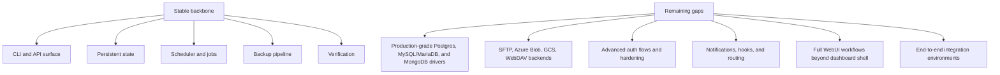

Recommended next engineering slices:

1. Extend PostgreSQL hardening around broader upgrade rehearsal evidence.
2. Expand database driver coverage to MongoDB.
3. Deepen the WebUI from operational dashboard shell into resource CRUD and job detail workflows.
4. Add storage backend parity for the domain-level kinds already present in `core.StorageKind`.
5. Harden production auth, token lifecycle, and audit coverage around every mutation.

## Architectural Principles

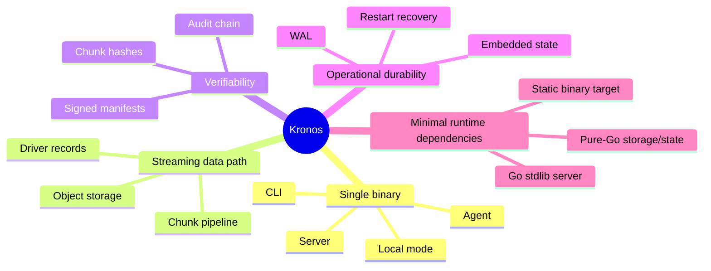

## What To Read Next

- `README.md` for product status and operator-facing examples.
- `.project/SPECIFICATION.md` for product requirements.
- `.project/IMPLEMENTATION.md` for the full target architecture blueprint.
- `docs/quickstart.md` for first-run usage.
- `docs/operations.md` for production runbooks.
- `api/openapi/openapi.yaml` for the REST contract.
