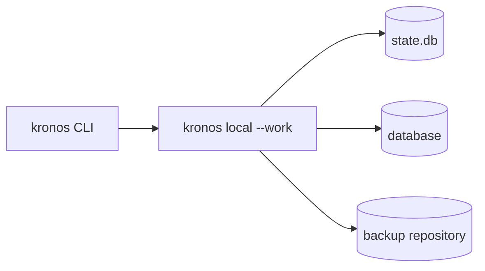
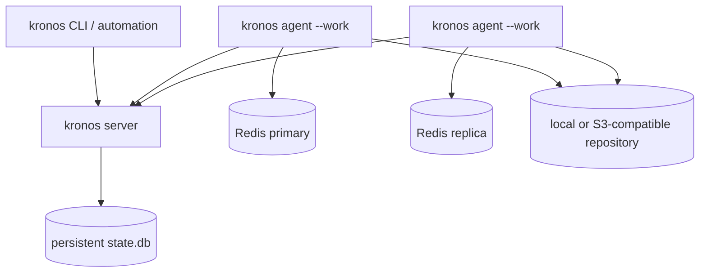
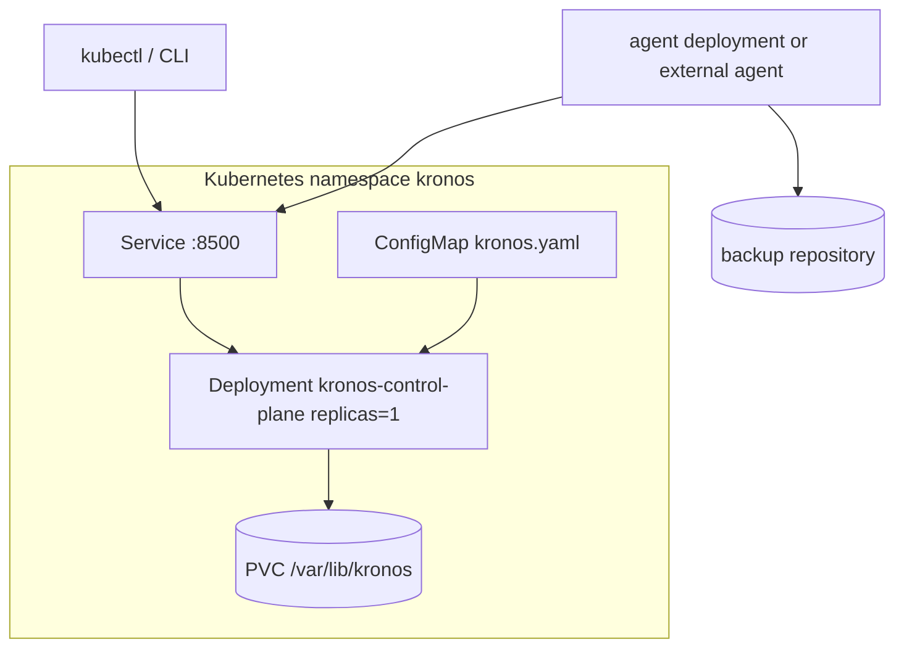
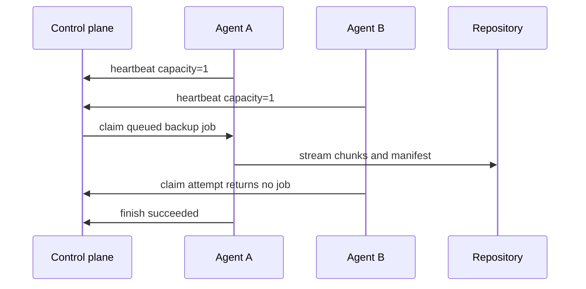

# Deployment Topologies

Kronos ships as one binary, but production deployments should choose the
smallest topology that keeps the control plane, agents, state, secrets, and
backup repository easy to operate.

## Decision Matrix

| Topology | Best For | Control Plane | Agents | State | Notes |
| --- | --- | --- | --- | --- | --- |
| Local single node | Labs, break-glass local backup | `kronos local --work` | Embedded | Local disk | Fastest bootstrap; keep it bound to localhost. |
| Split server and agents | Small production fleets | One `kronos server` | One or more `kronos agent --work` | Persistent control-plane disk | Recommended default while the embedded state backend is local. |
| Kubernetes single replica | Containerized production | One Deployment replica | Separate agent Deployments or external agents | PVC | Good operational wrapper; avoid multiple control-plane replicas until state is externalized. |
| Hot standby agents | Critical targets | One control plane | Two agents can see the same target | Persistent control-plane disk | Agents are stateless; job claiming keeps one worker active per queued job. |

## Local Single Node

Use this topology for development, home lab setups, and emergency local
operations. It minimizes moving parts by running the control plane and worker in
one process. In production, bind it to loopback or put it behind a trusted
private network and still use scoped tokens for automation.

## Split Control Plane And Agent Fleet

This is the recommended default for production. Agents run near the databases,
dial the control plane, claim queued jobs, stream directly to storage, and can
be restarted without losing control-plane state. Keep the control-plane state
directory on reliable storage and back it up like any other operational
database.

## Kubernetes Single Replica

Start from [deploy/kubernetes](../deploy/kubernetes/README.md). Keep
`replicas: 1` for the control plane while it uses embedded local state. Scale
workers by adding agents, not by adding control-plane replicas. Use Kubernetes
Secrets or an external secret injector for manifest signing keys, chunk keys,
tokens, and repository credentials.

## Hot Standby Agents

Use hot standby agents when a target is critical and workers may be restarted
during maintenance. Both agents can be configured for the same target and
storage, but only the agent that successfully claims a job executes it. Keep
agent capacity conservative for databases that should not run parallel backup
work.

## Production Guardrails

- Use immutable release artifacts or image digests, not mutable `latest` tags.
- Keep the control-plane state directory on durable storage and include it in
  backup/restore exercises.
- Store signing keys, chunk keys, bearer tokens, and repository credentials in a
  secret manager rather than plain config files.
- Run `kronos ready`, scrape `/metrics`, and alert on backup freshness before
  enabling unattended schedules.
- Exercise at least one restore path after every material driver, storage, or
  key-management change.
- Prefer scaling agents horizontally before changing the control-plane topology.
