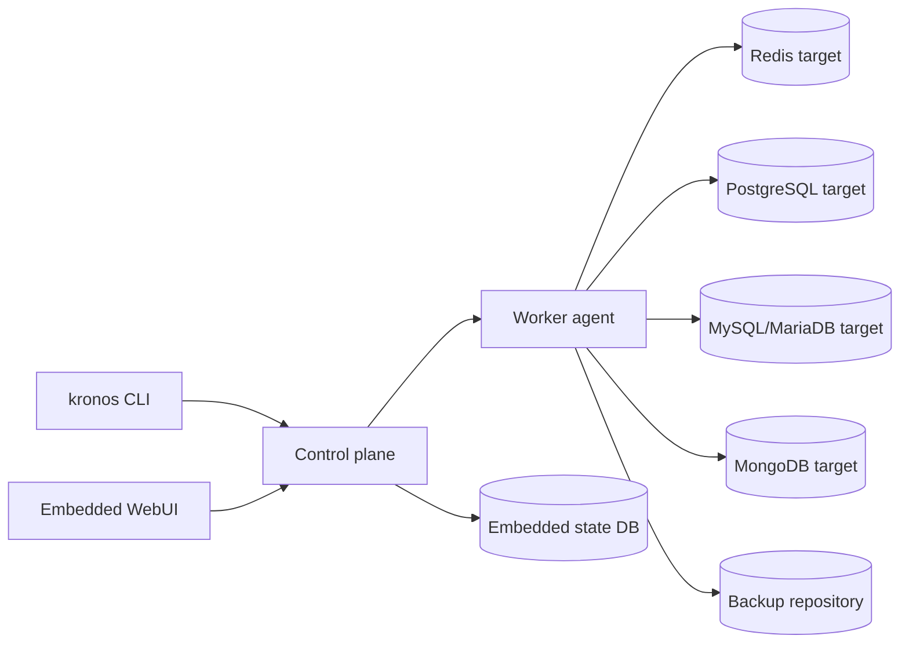

# Project Status

Last reviewed from the repository state on April 29, 2026.

Kronos is currently a working Phase 1 / early Phase 2 backup platform rather
than a bare scaffold. The core control plane, CLI, state store, scheduler,
agent worker, backup pipeline, restore planning, retention engine, audit log,
OpenAPI contract, operations documentation, and observability surface are in
place and covered by tests.

## Current Shape



## Completed Foundations

- Single Go binary with server, local, agent, and administrative CLI modes.
- Embedded kvstore with WAL, B+Tree buckets, repair coverage, and persisted
  control-plane stores.
- Local and S3-compatible storage backends.
- Chunking, deduplication, compression, encryption envelopes, signed manifests,
  and manifest/chunk verification.
- Redis backup and restore driver coverage, including ACL and command-stream
  replay paths.
- PostgreSQL logical driver MVP using `pg_dump` plain SQL output for full
  backups and `psql` for restores, with PostgreSQL 15, 16, and 17 conformance
  coverage plus focused restore rehearsal evidence.
- MySQL/MariaDB logical driver MVP using `mysqldump`/`mysql` with real-service
  MySQL 8.4 and MariaDB 11.4 conformance plus bidirectional restore rehearsal
  coverage.
- MongoDB logical driver MVP using `mongodump`/`mongorestore` archives with
  authenticated MongoDB 7.0 conformance and a 10,000-document restore drill.
- Persistent scheduler and queued/running/terminal job lifecycle.
- Agent worker resource sync, heartbeat, job claim, backup execution, restore
  execution, and finish reporting.
- REST API for resources, jobs, backups, retention, restore, audit, users, and
  tokens, with checked OpenAPI coverage.
- Restore evidence artifacts are persisted in a dedicated evidence store and
  remain exportable by job ID even when the job record is no longer present.
- Token-based authorization with scoped bearer tokens, role-capped token
  creation, inactive token pruning, request IDs, and audit recording for
  mutations.
- Direct control-plane TLS with optional client-certificate verification for
  agent mTLS enrollment.
- Baseline HTTP security headers for API and embedded WebUI responses.
- Webhook notification rules for terminal job events, API management, optional
  HMAC payload signatures, bounded retries, and delivery metadata in the audit
  chain.
- Dashboard-oriented operations overview API with inventory counts, active job
  state, backup totals, readiness state, attention counters, and latest activity
  slices.
- Readiness, health, Prometheus metrics with `GET`/`HEAD` probe support,
  operations docs, CLI docs, quickstart, architecture docs, deployment topology
  guidance, restore drill guidance, multi-platform release artifacts, checksums,
  provenance metadata, SBOM metadata, release artifact smoke checks, container
  builds, GitHub release publishing, Kubernetes deployment examples, and cloud
  secret integration guidance.

## Recent Progress

```mermaid
flowchart TB
    Metrics[Observability hardening]
    Ready[Readiness endpoint and CLI]
    Docs[Status and operations documentation]

    Metrics --> BuildInfo[kronos_build_info]
    Metrics --> Uptime[process start and uptime metrics]
    Metrics --> Inventory[inventory distribution metrics]
    Metrics --> Jobs[job operation and agent load metrics]
    Metrics --> BackupFreshness[latest backup freshness metrics]
    Metrics --> Tokens[token revoked/expired metrics]
    Metrics --> Alerts[Prometheus alert examples]

    Ready --> ReadyEndpoint[/readyz]
    Ready --> Stores[persistent store checks]
    Ready --> ReadyCLI[kronos ready]
    Ready --> Completion[completion coverage]

    Docs --> OpenAPI[OpenAPI descriptions]
    Docs --> Ops[operations runbook]
    Docs --> Status[project status snapshot]
```

## Verification State

The repository currently passes the full Go test suite:

```bash
.tools/go/bin/go test ./...
```

The production-readiness gate is also available without relying on `make`:

```bash
GO=.tools/go/bin/go ./scripts/production-check.sh
```

This gate checks Go formatting, runs `go vet`, runs the full test suite, builds
the binary, validates shell scripts, validates generated bash completion
syntax, and verifies that `kronos version` can execute. The docs test also
checks local Markdown links, and the OpenAPI package has a checked spec test.
The current explicit `not implemented` markers are
intentional fail-fast boundaries for roadmap database drivers and storage
backends; unsupported capabilities are surfaced early instead of falling
through to ambiguous runtime behavior.

Tagged E2E coverage is available for the implemented worker/control-plane/Redis
backup and restore path, retention apply metadata pruning, and lost-agent
recovery during job claim. The same tagged suite also covers server restart
recovery for active jobs reopened from persisted state, plus PostgreSQL
worker/control-plane/local-storage backup and restore smoke coverage through
fake `pg_dump` and `psql` tools:

```bash
.tools/go/bin/go test -tags=e2e ./cmd/kronos
```

## Known Gaps

See [Production Readiness](production-readiness.md) for the current release
gate, readiness estimate, and next engineering slices.

Kronos is usable for its implemented Redis/local/S3-oriented paths, and now has
PostgreSQL, MySQL/MariaDB, and MongoDB logical driver MVPs. It is not yet a
broad multi-database production suite. The largest remaining areas are:

- PostgreSQL operational hardening. Current PostgreSQL driver coverage includes
  command-runner unit coverage over `pg_dump` and `psql`, tagged worker
  pipeline smoke E2E coverage with fake client tools, and CI real-service
  conformance across PostgreSQL 15, 16, and 17 with restore data verification
  for extension-backed data, large objects, indexed JSONB bulk rows, explicit
  `replace_existing=true` guardrails, single-transaction `psql` execution,
  rollback behavior for failed restores, and optional `include_globals=true`
  capture of PostgreSQL role metadata through
  `pg_dumpall --globals-only --no-role-passwords`, including a conformance
  assertion that role password material is not emitted and a focused
  `postgres_globals` restore drill for role metadata. CI also runs a
  PostgreSQL 15-to-17 restore rehearsal and a PostgreSQL 17 full global restore
  rehearsal that replays actual globals plus database streams into a separate
  target, plus a PostgreSQL 17 operator-scale restore drill that verifies
  10,000 indexed JSONB rows across separate source and target services.
  Remaining hardening is around broader upgrade rehearsal evidence.
- Additional database driver depth. Current executable driver coverage is
  Redis/Valkey, the PostgreSQL logical MVP, a MySQL/MariaDB
  `mysqldump`/`mysql` logical MVP with unit coverage plus real-service MySQL
  8.4 and MariaDB 11.4 conformance for backup/restore of indexed JSON data,
  bidirectional MySQL/MariaDB restore rehearsals, and 10,000-row
  MySQL/MariaDB restore drills, and a MongoDB `mongodump`/`mongorestore`
  archive MVP with unit coverage, authenticated MongoDB 7.0 real-service
  conformance, and an authenticated 10,000-document MongoDB restore drill.
  MongoDB still needs broader version/recovery coverage.
- Additional storage backends such as SFTP, Azure Blob, and Google Cloud
  Storage. Current executable backends are local filesystem and S3-compatible
  object storage.
- Deeper WebUI interaction beyond the current authenticated live
  overview/jobs/backups/inventory dashboard plus
  target/storage/schedule/retention/job/backup detail, schedule pause/resume,
  target/storage/schedule/retention create/update editing, guarded target/storage
  deletion, manual backup drill queueing, backup metadata verification,
  byte-level backup verification queueing, verification result display, backup
  verification history, restore preview plus guarded dry-run/live restore
  queueing, restore job history with restore outcome summaries and
  hash-addressed evidence artifacts, job cancel/retry, and backup protection
  actions.
- Richer notification channels and hook execution surfaces from the product
  plan.
- Broader production hardening around auth integrations and future
  multi-instance operational patterns. The current Kubernetes manifests now
  document and enforce the supported single-replica control-plane boundary.

## Next Best Work

1. Add broader MongoDB version/recovery coverage beyond the authenticated
   MongoDB 7.0 archive restore drills.
2. Extend PostgreSQL hardening around broader upgrade rehearsal evidence.
3. Add additional notification channels and hook execution surfaces.
4. Run a signed-tag release rehearsal and archive checksum, signature, and
   attestation verification evidence.
5. Add cloud-specific deployment overlays for common managed Kubernetes
   environments.
