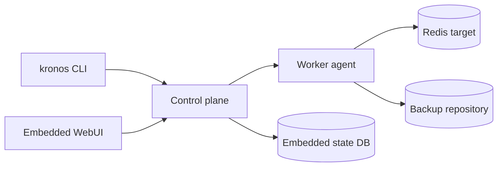

# Project Status

Last reviewed from the repository state on April 26, 2026.

Kronos is currently a working Phase 1 / early Phase 2 backup platform rather
than a bare scaffold. The core control plane, CLI, state store, scheduler,
agent worker, backup pipeline, restore planning, retention engine, audit log,
OpenAPI contract, operations documentation, and observability surface are in
place and covered by tests.

## Current Shape



## Completed Foundations

- Single Go binary with server, local, agent, and administrative CLI modes.
- Embedded kvstore with WAL, B+Tree buckets, repair coverage, and persisted
  control-plane stores.
- Local and S3-compatible storage backends.
- Chunking, deduplication, compression, encryption envelopes, signed manifests,
  and manifest/chunk verification.
- Redis backup and restore driver coverage, including ACL and command-stream
  replay paths.
- Persistent scheduler and queued/running/terminal job lifecycle.
- Agent worker resource sync, heartbeat, job claim, backup execution, restore
  execution, and finish reporting.
- REST API for resources, jobs, backups, retention, restore, audit, users, and
  tokens, with checked OpenAPI coverage.
- Token-based authorization with scoped bearer tokens, role-capped token
  creation, inactive token pruning, request IDs, and audit recording for
  mutations.
- Webhook notification rules for terminal job events, with delivery metadata in
  the audit chain.
- Readiness, health, Prometheus metrics, operations docs, CLI docs, quickstart,
  architecture docs, deployment topology guidance, restore drill guidance,
  multi-platform release artifacts, checksums, provenance metadata, SBOM
  metadata, container builds, GitHub release publishing, Kubernetes deployment
  examples, and cloud secret integration guidance.

## Recent Progress

```mermaid
flowchart TB
    Metrics[Observability hardening]
    Ready[Readiness endpoint and CLI]
    Docs[Status and operations documentation]

    Metrics --> BuildInfo[kronos_build_info]
    Metrics --> Uptime[process start and uptime metrics]
    Metrics --> Inventory[inventory distribution metrics]
    Metrics --> Jobs[job operation and agent load metrics]
    Metrics --> BackupFreshness[latest backup freshness metrics]
    Metrics --> Tokens[token revoked/expired metrics]
    Metrics --> Alerts[Prometheus alert examples]

    Ready --> ReadyEndpoint[/readyz]
    Ready --> ReadyCLI[kronos ready]
    Ready --> Completion[completion coverage]

    Docs --> OpenAPI[OpenAPI descriptions]
    Docs --> Ops[operations runbook]
    Docs --> Status[project status snapshot]
```

## Verification State

The repository currently passes the full Go test suite:

```bash
.tools/go/bin/go test ./...
```

The docs test also checks local Markdown links, and the OpenAPI package has a
checked spec test. The latest scans did not find outstanding `TODO`, `FIXME`,
or `not implemented` markers in the primary source and docs paths.

## Known Gaps

Kronos is usable for its implemented Redis/local/S3-oriented paths, but it is
not yet a broad multi-database production suite. The largest remaining areas
are:

- Additional database drivers such as PostgreSQL, MySQL, and MongoDB.
- Additional storage backends such as SFTP, Azure Blob, and Google Cloud
  Storage.
- Deeper WebUI interaction against real API data beyond the current embedded
  dashboard shell.
- Richer notification channels and hook execution surfaces from the product
  plan.
- Broader production hardening around auth integrations and multi-instance
  operational patterns.

## Next Best Work

1. Add another first-class database driver, starting with the smallest useful
   backup/restore slice and conformance tests.
2. Wire the WebUI to live API endpoints for dashboard state, jobs, backups, and
   agents.
3. Add retries, signing, and additional channels for notification delivery.
4. Sign release provenance and SBOM metadata with keyless CI identity.
5. Add cloud-specific deployment manifests for common managed Kubernetes
   environments.
